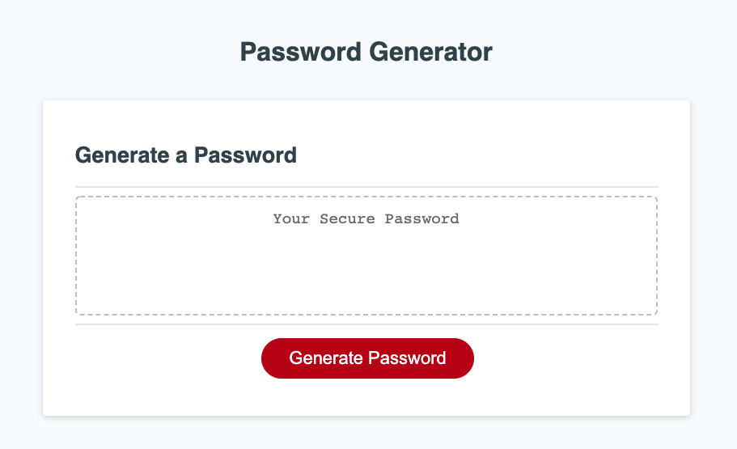

# Workday-Scheduler

Deployed Link: laurenzel93.github.io/password-generator/  
Repo Link: github.com/Laurenzel93/password-generator  

This app will randomly generate a password based on preferences determined by the  
user including character length and the inclusion or omission of lowercase letters,  
uppercase letters, numbers, and special characters. 
Techologies: HTML, CSS, JavaScript 

